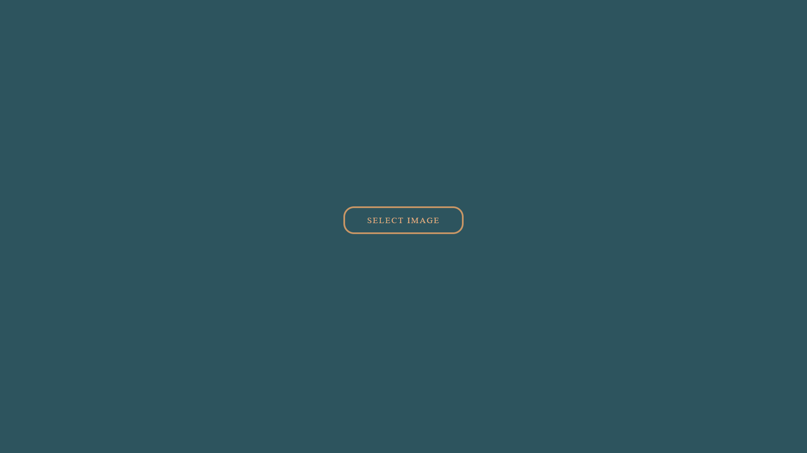
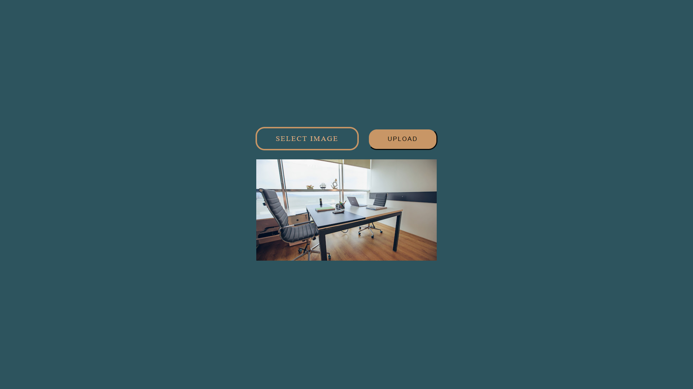
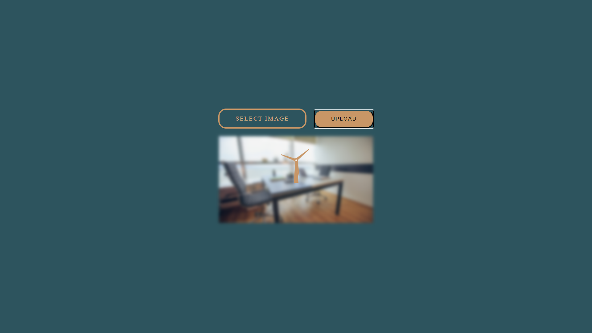
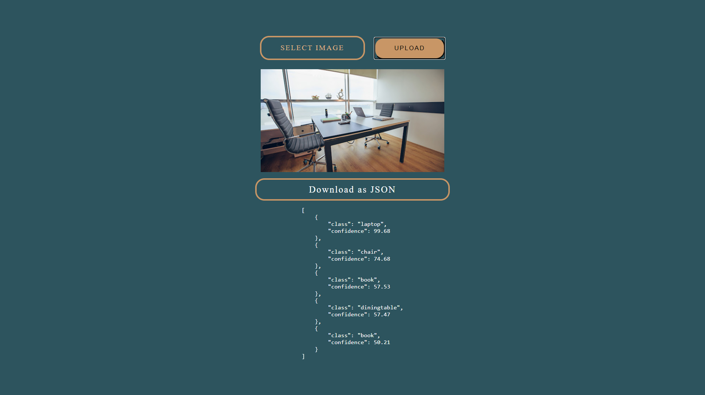

# object-detection-app

https://bs-detection.herokuapp.com/

This app detects objects in an image and returns detections as JSON by using REST api which uses [yolov3](https://pjreddie.com/darknet/yolo/) with [COCO dataset.](https://cocodataset.org/#home)

## Project Structure
The app uses React in client-side and Node.js (Express framework) in server-side.

## API

The api is Flask API and running on DigitalOcean droplet. It reads images and runs YoloV3 detection model over image. Then, server returns class and accuracy of the detected objects as JSON response.

## Screenshots

  
  
   
  
  

